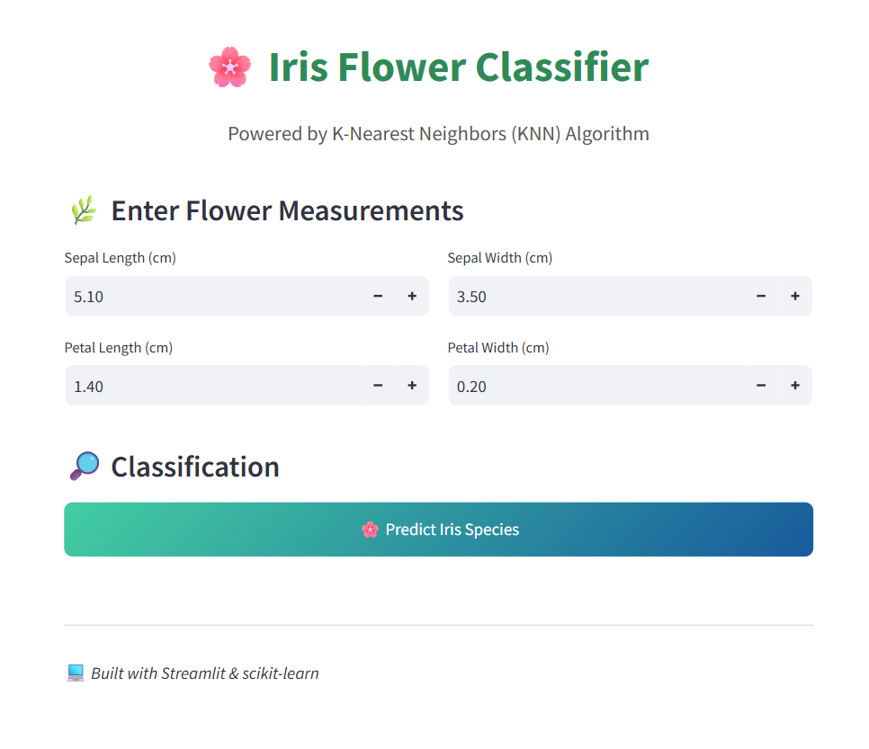
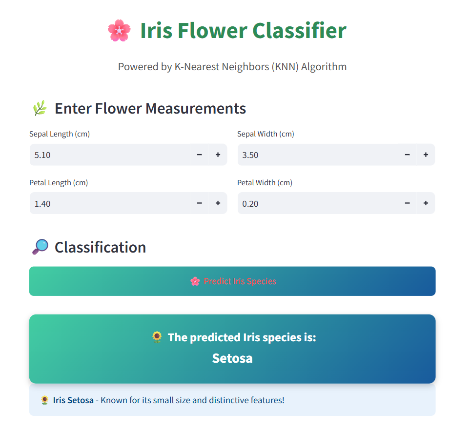

## Iris Classification using KNN

This project demonstrates how to classify iris flowers into three species using the K-Nearest Neighbors (KNN) algorithm. It provides a reproducible workflow for training, evaluating, and deploying a machine learning model with both a Jupyter notebook and a Streamlit web app.

## Overview

The objective is to predict the species of an iris flower—Iris setosa, Iris versicolor, or Iris virginica—based on four flower measurements:

1. Sepal length

2. Sepal width

3. Petal length

4. Petal width

The Iris dataset is a well-known benchmark in machine learning. KNN was chosen for its simplicity and strong performance on small, structured datasets.

## Dataset

- Source: UCI Machine Learning Repository – Iris Dataset

- Samples: 150

- Features: 4 numerical attributes (sepal and petal dimensions)

## Classes: 3 species

- Iris setosa

- Iris versicolor

- Iris virginica

## Streamlit UI

## Project Structure

Iris-Classification-using-KNN/
│
├── app.py # Streamlit app
├── iris_classification.ipynb # Jupyter notebook with training & evaluation
├── knn_iris_model.pkl # Trained KNN model
├── scaler_iris.pkl # Scaler for preprocessing
├── requirements.txt # Dependencies
├── iris_knn_ui1.png # Streamlit app UI screenshot
└── iris_knn_prediction_ui2.png
└── README.md # Project documentation

## Installation

Clone the repository and install dependencies:

git clone https://github.com/BinCha1/Iris-Classification-using-KNN.git
cd Iris-Classification-using-KNN
pip install -r requirements.txt

## Results

The KNN classifier achieves strong accuracy on the Iris dataset.
